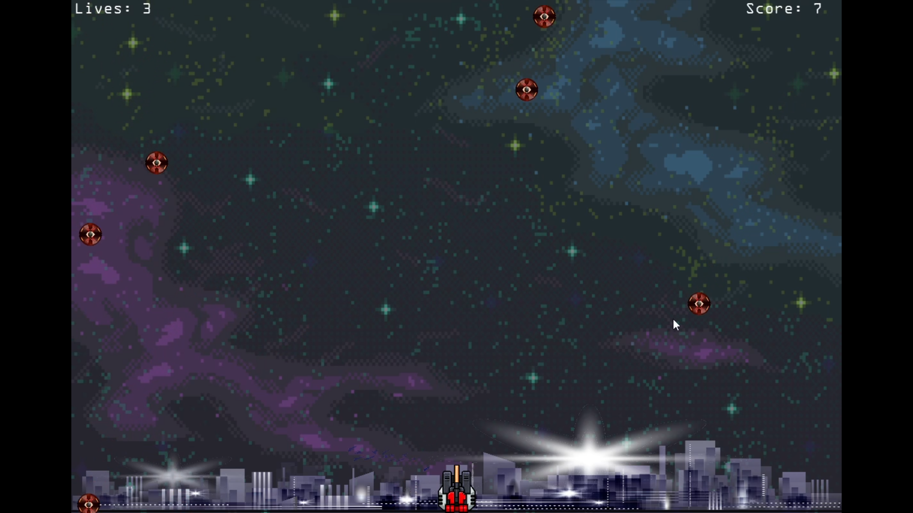

# missile_command_clone
Remake of the famous Atari game Missile Command using C++ and OpenGL.

Technologies Used
<ul>
  <li>C++</li>
  <li>OpenGL</li>
  <li>IrrKlang</li>
  <li>FreeType</li>
</ul>

<h2>Overview</h2>
A game where you have to stop the incoming bombs from reaching the city

<h2>Gameplay Demo</h2>
https://github.com/Likhon423/missile_command_clone/blob/master/images/Media1.mkv
